# Práctica GitHub + MarkDown

**Autor:** Roberto Martín

---

## Introducción

GitHub es una plataforma web que permite alojar proyectos utilizando el sistema de control de versiones Git. Un sistema de control de versiones es una herramienta que registra los cambios realizados en los archivos de un proyecto a lo largo del tiempo, permitiendo consultar el historial de modificaciones, volver a versiones anteriores y colaborar con otras personas sin perder información ni sobrescribir el trabajo de los demás.

GitHub se ha convertido en una de las herramientas más utilizadas en el mundo del desarrollo de software, ya que ofrece una interfaz gráfica sencilla que facilita tareas que, de otra forma, requerirían el uso de la terminal y comandos de Git. Entre sus usos principales destacan:

- Crear y gestionar repositorios.
- Colaborar con otros desarrolladores de forma organizada.
- Llevar un control detallado de los cambios mediante *commits*.
- Trabajar en distintas versiones de un proyecto a través de *ramas* (branches).
- Gestionar quién puede acceder y modificar un repositorio.

En este informe se explican, paso a paso, las principales funciones de GitHub: la creación de una cuenta y un repositorio, la subida de archivos, la consulta del historial de cambios, la creación y fusión de ramas, y la gestión de la configuración y los permisos del repositorio.

---

## Paso 1: Crear una cuenta y un repositorio en GitHub

### 1.1 Crear una cuenta en GitHub

Si todavía no dispones de una cuenta, accede a [GitHub](https://github.com) y regístrate siguiendo el proceso indicado en la propia web.

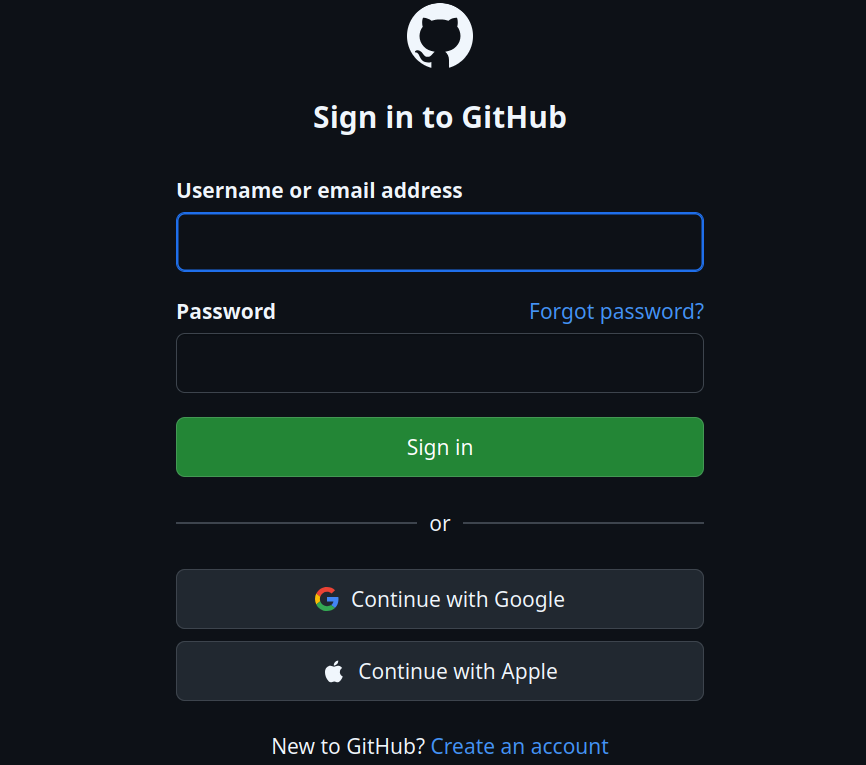

### 1.2 Crear un nuevo repositorio

Una vez iniciada la sesión, existen dos formas de crear un repositorio:

- Si acabas de crear la cuenta, puedes hacer clic directamente en **"Create repository"**.
- Si ya tienes cuenta, haz clic en el botón **"New"** situado en la esquina superior derecha de la pantalla, o accede a tu perfil, entra en la sección **"Repositories"** y selecciona **"New"**.

En la página que se abre, es necesario rellenar los siguientes campos:

- **Repository name:** nombre del repositorio (por ejemplo, `pruebaGitHub`).
- **Description:** una breve descripción del proyecto (opcional).
- **Visibilidad:** puede elegirse entre **público** o **privado**. En este caso se ha optado por un repositorio **público**.
- **Initialize this repository with a README:** al marcar esta opción se crea automáticamente un archivo `README.md` inicial.

Finalmente, se pulsa el botón **"Create repository"** para completar la creación.

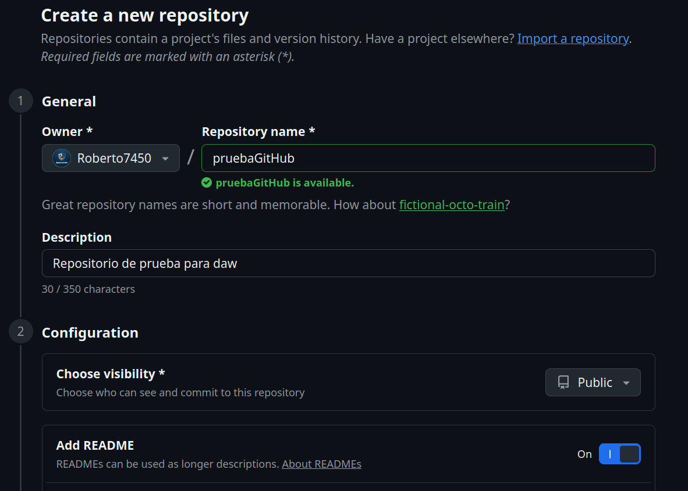

---

## Paso 2: Subir archivos al repositorio

Una vez creado el repositorio, es posible subir archivos de forma sencilla desde la propia interfaz web, sin necesidad de utilizar la terminal.

### 2.1 Acceder al repositorio

Tras crear el repositorio, se accede automáticamente a su página principal.

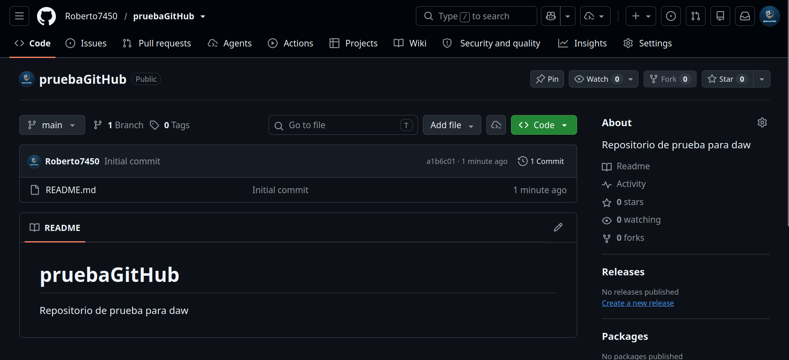

### 2.2 Subir archivos

En la página del repositorio se debe hacer clic en el botón **"Add file"**, situado encima de la lista de archivos, y seleccionar la opción **"Upload files"**.

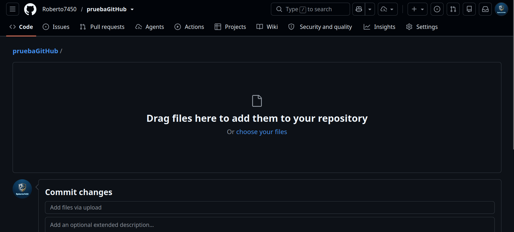

### 2.3 Subir el archivo desde el ordenador

Se puede arrastrar el archivo directamente a la zona indicada o hacer clic sobre ella para seleccionarlo desde el explorador de archivos del equipo.

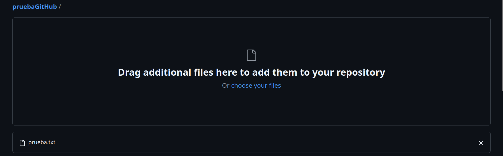

### 2.4 Confirmar los cambios (commit)

Tras subir el archivo, aparece una pantalla en la que se puede añadir un mensaje de confirmación, equivalente al comando `git commit`:

- En el campo **"Commit changes"** se escribe un mensaje descriptivo, por ejemplo: *"Subiendo archivo de prueba"*.
- Se debe comprobar que está seleccionada la opción **"Commit directly to the main branch"** si se desea aplicar los cambios directamente sobre la rama principal (`main`).
- Por último, se hace clic en **"Commit changes"** para finalizar el proceso.

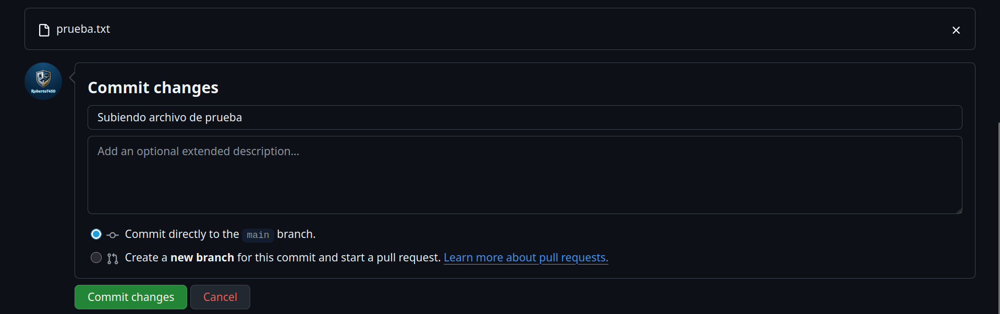

---

## Paso 3: Consultar archivos y commits

### 3.1 Ver los archivos subidos

Una vez subidos los archivos, estos aparecen listados en el repositorio. Se puede acceder a cualquiera de ellos haciendo clic sobre su nombre para consultar su contenido.

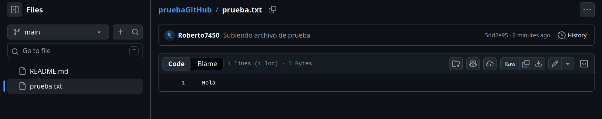

### 3.2 Ver el historial de commits

Para consultar el historial de cambios realizados en el repositorio, se accede a la pestaña **"Commits"**, situada encima de la lista de archivos. Allí se muestra un listado con todos los commits realizados, junto con su mensaje y el autor de cada uno.

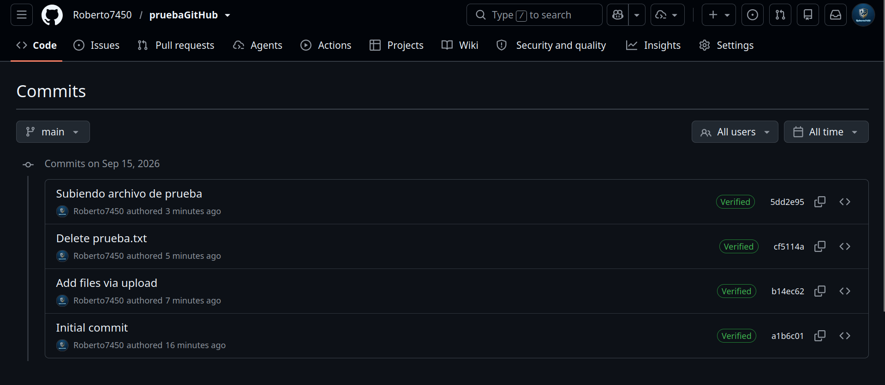

---

## Paso 4: Crear y administrar ramas (branches)

Las ramas permiten trabajar en distintas versiones de un mismo proyecto sin afectar a la rama principal (`main`) hasta que los cambios se consideren definitivos.

### 4.1 Crear una nueva rama

Desde la página principal del repositorio, se hace clic en el menú desplegable que muestra la rama actual (por ejemplo, `main`), se escribe el nombre de la nueva rama y se pulsa **"Create branch"**. Automáticamente se accede a la nueva rama creada.

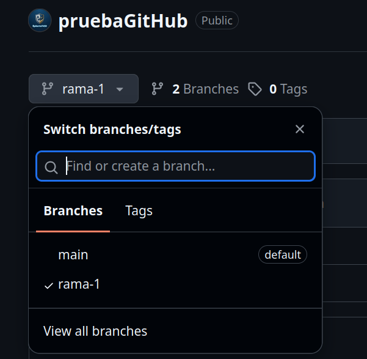

### 4.2 Modificar archivos en una rama

Desde la nueva rama es posible añadir o modificar archivos siguiendo el mismo procedimiento explicado en el Paso 2. Los cambios realizados en esta rama no afectan a la rama `main` hasta que se decida fusionarlos.

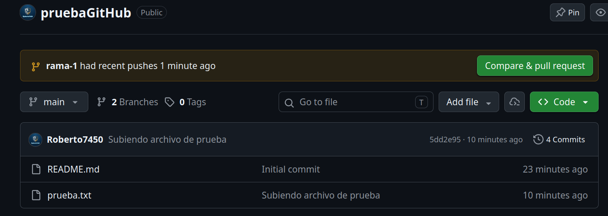

### 4.3 Fusionar ramas (merge)

Para incorporar los cambios de una rama a la rama principal, es necesario crear un **pull request**:

1. Acceder a la pestaña **"Pull requests"** del repositorio.
2. Hacer clic en **"New pull request"**.
3. Seleccionar las ramas que se desean comparar y fusionar, y pulsar **"Create pull request"**.

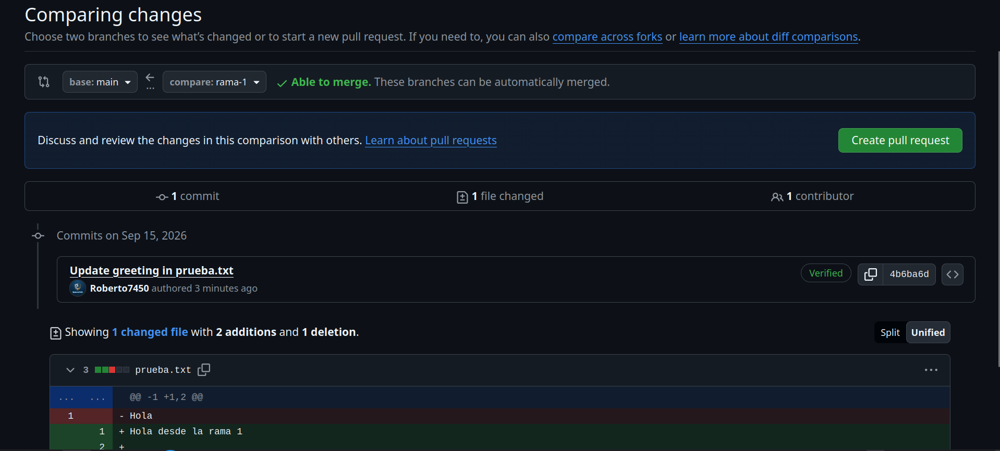

4. Tras revisar los cambios, hacer clic en **"Merge pull request"** para combinarlos con la rama principal.

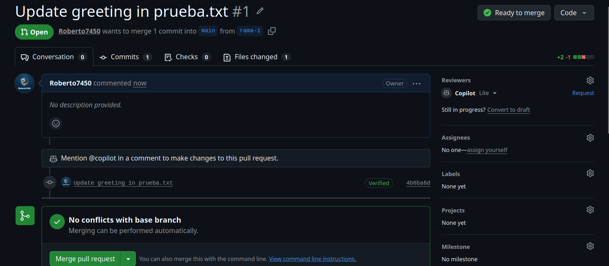

---

## Paso 5: Gestionar la configuración y los permisos

GitHub permite configurar distintos aspectos del repositorio, como su visibilidad o los colaboradores que tienen acceso a él.

### 5.1 Configuración del repositorio

Desde el botón **"Settings"**, situado en la parte superior del repositorio, se puede modificar el nombre, la descripción, la visibilidad y otros ajustes generales.

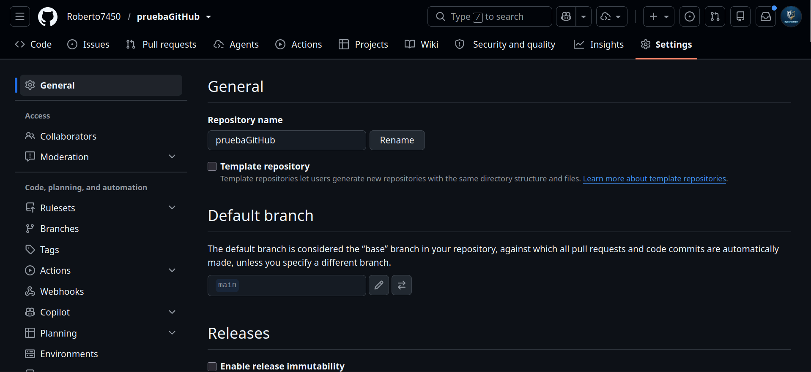

### 5.2 Permisos y colaboradores

En la sección **"Collaborators"** es posible añadir a otras personas para que trabajen en el repositorio, otorgándoles permisos de acceso según sea necesario.

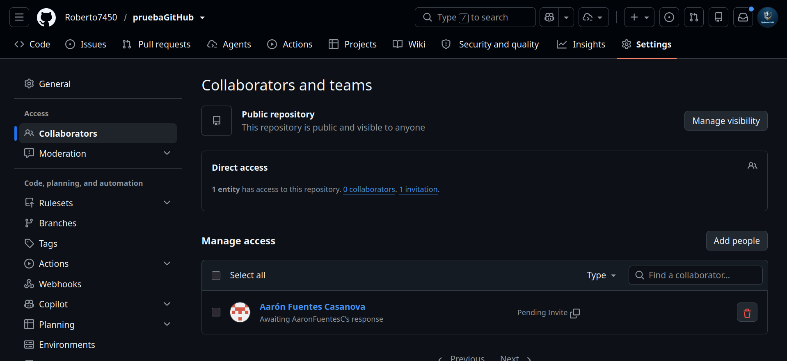

---

## Resumen visual de las acciones en GitHub

| Acción | Descripción |
|---|---|
| Crear un repositorio | Crea un nuevo repositorio desde la página de GitHub. |
| Subir archivos | Usa el botón "Add file" para cargar archivos desde el ordenador. |
| Hacer commits | Confirma los cambios escribiendo un mensaje de commit. |
| Crear ramas (branches) | Crea nuevas ramas desde la interfaz web de GitHub. |
| Fusión de ramas (merge) | Realiza un pull request para fusionar ramas. |
| Administrar colaboradores | Añade colaboradores desde la pestaña "Settings". |

---

## Conclusiones

GitHub permite realizar todas las operaciones básicas de Git: subir archivos, hacer commits, crear y gestionar ramas, fusionarlas y colaborar con otras personas de forma completamente gráfica, sin necesidad de recurrir a la terminal. Esto convierte a la plataforma en una herramienta muy accesible, tanto para quienes ya dominan Git desde la línea de comandos como para quienes se están iniciando en el control de versiones.

Además, GitHub facilita el trabajo colaborativo gracias a funciones como los pull requests y la gestión de permisos, lo que permite que varias personas trabajen sobre un mismo proyecto de manera ordenada y segura, garantizando en todo momento la trazabilidad de los cambios realizados.
